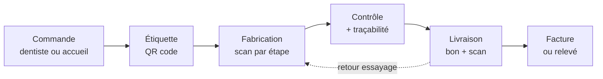

# Cahier des charges — Plateforme de gestion pour laboratoires de prothèses dentaires

> Document de référence du projet. Version du 19 septembre 2026.
> Source : document de cadrage rédigé avec Claude.

## 1. Contexte et objectifs

Le produit est une plateforme web (SaaS) qui permet à un laboratoire de prothèses dentaires de gérer toute son activité : commandes des dentistes, fabrication, traçabilité, livraison et facturation. Délai estimé : 4 mois pour une première version utilisable par un labo pilote, 7 à 8 mois pour une version commercialisable (détail en section 6).

**Le problème.** Un laboratoire reçoit chaque jour des dizaines de travaux (couronnes, bridges, appareils amovibles, gouttières) de plusieurs cabinets. Beaucoup travaillent encore avec des fiches papier, Excel ou un vieux logiciel installé sur un seul PC. Résultat : travaux perdus de vue, retards, erreurs de facturation, et une traçabilité réglementaire difficile à produire.

**Les objectifs du produit.**

- Centraliser le cycle complet : commande → fabrication → contrôle → livraison → facture → paiement.
- Donner aux dentistes un espace en ligne pour commander et suivre leurs travaux.
- Produire automatiquement les documents obligatoires (fiche de traçabilité, déclaration de conformité).
- Fonctionner sur ordinateur, tablette et téléphone, sans installation.
- Être multi-laboratoires : chaque labo client a son espace isolé, avec un abonnement mensuel.

**Référence du marché.** Logidents couvre ce périmètre (facturation, traçabilité, extranet praticiens, suivi par codes-barres). Ce cahier des charges vise un niveau fonctionnel équivalent, avec des pistes de différenciation en V2.

## 2. Utilisateurs et rôles

Cinq profils utilisent la plateforme, chacun avec des droits différents.

| Profil | Qui | Ce qu'il fait | Support principal |
|---|---|---|---|
| Gérant du laboratoire | Patron ou responsable administratif | Paramètre le labo, les tarifs, les clients ; facture ; suit les indicateurs | Ordinateur |
| Prothésiste | Technicien à l'établi | Voit ses travaux du jour, scanne le code du travail, valide son étape, note les matériaux utilisés | Tablette ou téléphone |
| Secrétaire / accueil | Administratif | Saisit les commandes reçues par coursier ou téléphone, prépare les bons de livraison | Ordinateur |
| Livreur / coursier | Interne ou prestataire | Voit sa tournée, scanne à l'enlèvement et à la livraison | Téléphone |
| Dentiste (et son assistante) | Client du labo | Passe commande, joint des fichiers, suit l'avancement, télécharge factures et fiches de traçabilité | Ordinateur ou téléphone |

Un sixième profil, **administrateur de la plateforme** (l'éditeur), gère les laboratoires abonnés, la facturation des abonnements et le support.

## 3. Périmètre fonctionnel

Le produit compte 12 modules, répartis en trois paliers : **MVP** (le minimum pour qu'un labo pilote travaille avec), **V1** (version vendable), **V2** (différenciation).

| # | Module | Contenu | Palier |
|---|---|---|---|
| 1 | Comptes et droits | Inscription du labo, utilisateurs, rôles, connexion sécurisée, double authentification | MVP |
| 2 | Clients (cabinets et praticiens) | Fiche cabinet, praticiens rattachés, adresses de livraison, grille tarifaire et remises par client | MVP |
| 3 | Catalogue et tarifs | Articles (couronne céramique, stéllite, gouttière…), gammes, prix, taux de TVA par article, matériaux associés | MVP |
| 4 | Commandes (bons de travail) | Saisie d'un travail : praticien, référence patient, dents concernées (schéma dentaire), teinte, articles, date de livraison souhaitée, pièces jointes ; numéro unique et étiquette QR code | MVP |
| 5 | Suivi de fabrication | Étapes paramétrables (plâtre, armature, céramique, finition, contrôle), scan du QR code à chaque étape, affectation au technicien, planning et retards | MVP |
| 6 | Traçabilité | Matériaux et numéros de lot utilisés par travail, génération de la fiche de traçabilité et de la déclaration de conformité en PDF | MVP |
| 7 | Livraison | Bons de livraison, tournées, scan à la remise, allers-retours (essayage puis finition) | MVP (bon de livraison) / V1 (tournées) |
| 8 | Facturation | Factures par travail ou relevé mensuel par cabinet, avoirs, numérotation légale, suivi des paiements, relances, export comptable | MVP (factures et relevés) / V1 (relances, export) |
| 9 | Extranet praticien | Commande en ligne, dépôt de fichiers (photos, empreintes numériques STL), suivi en temps réel, téléchargement des documents, messagerie avec le labo | V1 |
| 10 | Stocks matériaux | Entrées, sorties liées aux travaux, lots, dates de péremption, seuils d'alerte | V1 |
| 11 | Tableau de bord | Chiffre d'affaires par client et par article, délais moyens, taux de retouches, charge par technicien | V1 |
| 12 | Sous-traitance et import | Envoi de travaux à un labo partenaire ou à l'étranger, suivi des colis, marges | V2 |

**Pistes de différenciation (V2).**

- Lecture automatique des bons de commande papier ou photo par IA, pour éviter la ressaisie.
- Connexion aux scanners intra-oraux et aux logiciels de CAO dentaire (réception directe des fichiers).
- Notifications WhatsApp ou SMS au cabinet quand le travail part en livraison.
- Application mobile hors-ligne pour les livreurs.

**Parcours principal d'un travail.**

Un travail peut faire plusieurs allers-retours entre le cabinet et le labo (essayage) avant d'être facturé : le modèle de données doit le prévoir dès le départ.

## 4. Exigences réglementaires

Quatre sujets réglementaires conditionnent la conception ; ils sont cités de mémoire et **doivent être validés par un juriste ou un expert-comptable avant le développement**.

| Sujet | Ce que le logiciel doit faire | À vérifier |
|---|---|---|
| Dispositifs médicaux sur mesure (règlement européen 2017/745) | Une prothèse dentaire est un dispositif médical sur mesure. Le labo doit pouvoir fournir pour chaque travail une déclaration de conformité et la liste des matériaux et lots utilisés, et conserver ces données plusieurs années. | Durée exacte de conservation et mentions obligatoires de la déclaration |
| Facturation électronique | La réforme française impose progressivement la facture électronique entre entreprises (réception dès septembre 2026, émission pour les PME à partir de septembre 2027, selon le calendrier connu). Le logiciel doit produire des factures au format structuré (Factur-X) et se connecter à une plateforme agréée. | Calendrier à jour et choix de la plateforme partenaire |
| TVA sur les prothèses | Le taux doit être paramétrable par article. Logidents a annoncé une mise à jour liée à une nouvelle réglementation TVA sur les prothèses : les règles ont donc bougé récemment. | Règles actuelles d'exonération et cas d'application, avec un expert-comptable |
| RGPD et données de santé | Les bons de commande contiennent des informations patient (nom ou référence, dents, parfois âge). Prévoir : référence patient pseudonymisée par défaut, chiffrement, journal des accès, contrat de sous-traitance avec chaque labo, registre des traitements. | Si le nom du patient est stocké, l'hébergement certifié HDS (Hébergeur de Données de Santé) est probablement obligatoire |

Autres règles de facturation à respecter : numérotation continue sans trou, factures non modifiables après émission (correction par avoir), mentions légales complètes, archivage 10 ans.

## 5. Exigences techniques

La plateforme est une application web unique, multi-laboratoires, hébergée en France, utilisable depuis un navigateur sur tout appareil.

| Domaine | Exigence |
|---|---|
| Architecture | Application web responsive (pas d'application native au départ). Multi-tenant : une seule base, données de chaque labo strictement isolées par un identifiant de laboratoire contrôlé sur chaque requête. |
| Stack recommandée | Laravel (PHP) + Inertia + React, base PostgreSQL ou MySQL. C'est la stack déjà utilisée sur Jarvis 2.0 : réutilisation des briques (authentification, rôles, PDF, facturation). |
| QR codes / codes-barres | Génération côté serveur sur les étiquettes et bons ; lecture par la caméra du téléphone dans le navigateur, et par douchette USB sur ordinateur. |
| Documents | Génération PDF (bon de travail, bon de livraison, facture, fiche de traçabilité), modèles personnalisables avec le logo du labo. |
| Fichiers | Dépôt de photos et de fichiers 3D (STL, jusqu'à 200 Mo) sur un stockage objet, liens de téléchargement signés et limités dans le temps. |
| Sécurité | HTTPS partout, mots de passe hachés, double authentification pour les gérants, journal des actions sensibles, sauvegardes quotidiennes chiffrées avec test de restauration mensuel. |
| Hébergement | France (OVHcloud, Scaleway ou équivalent). Offre certifiée HDS si des noms de patients sont stockés. |
| Performance | Pages affichées en moins de 2 secondes ; un scan d'étape validé en moins d'1 seconde ; cible de 200 laboratoires et 2 000 utilisateurs simultanés sans refonte. |
| Disponibilité | 99,5 % en heures ouvrées, supervision et alertes. |
| Intégrations | Paiement des abonnements (Stripe), envoi d'e-mails transactionnels, plateforme de facturation électronique agréée, export comptable (FEC / CSV). |
| Reprise de données | Import CSV des clients, du catalogue et des tarifs pour faciliter le passage depuis Excel ou un autre logiciel. |
| Langues | Français au lancement, structure prête pour d'autres langues. |

## 6. Planning et délais

Avec un développeur à temps plein assisté par l'IA : 4 mois jusqu'au MVP chez un labo pilote, 7 à 8 mois jusqu'à la V1 commercialisable. Ce sont des estimations, à ± 30 %.

| Phase | Contenu | Durée | Fin cumulée |
|---|---|---|---|
| 0. Cadrage | 3 à 5 visites de laboratoires, validation du périmètre, maquettes des écrans clés, vérifications réglementaires | 3 semaines | Semaine 3 |
| 1. Socle | Comptes, rôles, multi-laboratoires, clients, catalogue et tarifs | 3 semaines | Semaine 6 |
| 2. Cœur métier | Commandes, schéma dentaire, QR codes, suivi de fabrication par scan | 5 semaines | Semaine 11 |
| 3. Documents | Traçabilité, bons de livraison, factures et relevés, PDF | 4 semaines | Semaine 15 |
| 4. Pilote | Mise en service chez 1 à 2 labos, corrections | 2 semaines | Semaine 17 (**MVP, 4 mois**) |
| 5. V1 | Extranet praticien, stocks, tableau de bord, tournées, relances, export comptable, facturation électronique, abonnements Stripe | 12 semaines | Semaine 29 |
| 6. Lancement | Tests de sécurité, documentation, import de données, site commercial | 3 semaines | Semaine 32 (**V1, 7 à 8 mois**) |

**Selon les moyens engagés.**

| Configuration | MVP | V1 |
|---|---|---|
| Vous seul, à temps partiel (en parallèle d'autres activités) | 7 à 9 mois | 12 à 15 mois |
| 1 développeur à temps plein + IA | 4 mois | 7 à 8 mois |
| Équipe de 3 (2 développeurs + 1 designer/produit) | 2,5 à 3 mois | 5 mois |

Le gain d'une équipe plus grande est limité par la phase de cadrage et le pilote, qui ne se compressent pas : ce sont les labos qui donnent le rythme.

## 7. Budget indicatif

En sous-traitant le développement, compter environ 40 000 à 70 000 € HT pour le MVP et 90 000 à 150 000 € HT pour la V1 complète. Ces fourchettes sont des ordres de grandeur approximatifs, à confirmer par devis.

| Poste | Fourchette (HT) |
|---|---|
| MVP par agence ou freelances (environ 80 à 110 jours à 450–650 €/jour) | 40 000 – 70 000 € |
| V1 complète par agence ou freelances (environ 200 à 250 jours) | 90 000 – 150 000 € |
| Développement en interne, avec l'IA | Votre temps + 100 à 300 €/mois d'outils |
| Hébergement standard en France | 50 – 150 €/mois |
| Hébergement certifié HDS (si noms de patients) | 300 – 800 €/mois |
| Validation juridique (RGPD, CGV, contrat de sous-traitance) | 2 000 – 5 000 € |
| Test d'intrusion avant lancement | 3 000 – 6 000 € |
| Plateforme de facturation électronique partenaire | Selon volume, souvent quelques centimes par facture |

**Repère de rentabilité.** Un abonnement de ce type se vend en général entre 80 et 250 € par mois et par laboratoire selon la taille. À 120 € en moyenne, 50 labos abonnés représentent 72 000 € de revenu annuel. Les tarifs réels des concurrents restent à relever.

## 8. Risques et points de vigilance

Le risque principal n'est pas technique : c'est de construire sans connaître le métier de prothésiste de l'intérieur.

| Risque | Conséquence | Parade |
|---|---|---|
| Méconnaissance du métier | Un outil logique sur le papier mais inutilisable à l'établi | Trouver 1 à 2 labos pilotes avant d'écrire du code ; passer une journée sur place |
| Marché de niche déjà équipé | Quelques milliers de labos en France, des concurrents installés, des clients peu enclins à changer | Se différencier (IA de saisie, extranet plus simple, prix) et soigner l'import de données |
| Données de santé | Hébergement HDS coûteux, responsabilité juridique | Pseudonymiser par défaut ; trancher la question HDS en phase de cadrage |
| Adoption par les techniciens | Si le scan prend plus de 3 secondes, il ne sera pas fait | Écran de scan ultra-simple, testé en atelier avec des gants et de la poussière de plâtre |
| Facturation incorrecte | Perte de confiance immédiate du gérant | Tests automatisés sur tous les calculs (remises, TVA, avoirs, relevés) |
| Dispersion | Projet mené en parallèle de plusieurs autres, délais qui doublent | Figer le périmètre MVP et refuser tout ajout avant le pilote |

## 9. Questions ouvertes

- [ ] Avez-vous déjà un laboratoire partenaire prêt à servir de pilote ?
- [ ] Le produit vise-t-il la France seule, ou aussi le Maroc et le Maghreb dès le départ (langues, fiscalité, devise) ?
- [ ] Stocke-t-on le nom du patient, ou seulement une référence ? La réponse décide de l'hébergement HDS.
- [ ] Développement par vous-même avec l'IA, par un freelance, ou par une agence ?
- [ ] Quel modèle de prix : par laboratoire, par utilisateur, ou par volume de travaux ?
- [ ] Quelles sont les règles de TVA actuelles sur les prothèses (à valider avec un expert-comptable) ?
- [ ] Quels sont les tarifs et les points faibles des concurrents (Logidents et les autres logiciels de labo) ?
