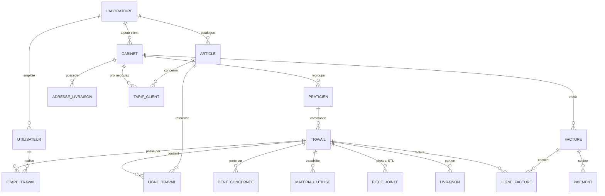

# Modèle de données — première esquisse

Document de travail. À valider en phase 0 avec un laboratoire pilote **avant** d'écrire
la première migration : une table oubliée ici coûte une refonte plus tard.

## Principe non négociable : le cloisonnement

Toute table métier porte une colonne `laboratoire_id`. Aucune requête ne doit pouvoir
lire les données d'un autre laboratoire. Chaque module est livré avec son test de
cloisonnement (« le labo A ne voit pas une donnée du labo B »).

## Schéma d'ensemble

## Tables du MVP

| Table | Rôle | Colonnes notables |
|---|---|---|
| `laboratoires` | Le client abonné | raison sociale, SIRET, logo, mentions légales, préfixe de numérotation |
| `utilisateurs` | Toute personne qui se connecte | `laboratoire_id`, rôle, 2FA |
| `cabinets` | Le cabinet dentaire client | `laboratoire_id`, raison sociale, TVA intracom, conditions de règlement |
| `praticiens` | Le dentiste, rattaché à un cabinet | `cabinet_id`, nom, numéro RPPS |
| `adresses_livraison` | Plusieurs adresses par cabinet | `cabinet_id` |
| `articles` | Le catalogue | `laboratoire_id`, libellé, gamme, prix, `taux_tva`, délai standard |
| `tarifs_clients` | Prix ou remise négociés | `cabinet_id`, `article_id`, prix ou pourcentage |
| `travaux` | **Le bon de travail — table centrale** | `laboratoire_id`, `praticien_id`, numéro unique, `reference_patient`, teinte, date souhaitée, statut |
| `lignes_travail` | Les articles du travail | `travail_id`, `article_id`, quantité, prix unitaire retenu |
| `dents_concernees` | Les dents visées (notation FDI) | `travail_id`, numéro de dent (11 à 48) |
| `etapes_modeles` | Étapes paramétrables par labo | `laboratoire_id`, libellé, ordre |
| `etapes_travail` | Le passage réel d'un travail par une étape | `travail_id`, `etape_modele_id`, `utilisateur_id`, scanné le, terminé le |
| `materiaux` | Les matériaux du labo | `laboratoire_id`, libellé, fabricant |
| `materiaux_utilises` | **Traçabilité réglementaire** | `travail_id`, `materiau_id`, `numero_lot`, quantité |
| `pieces_jointes` | Photos, STL | `travail_id`, chemin de stockage, taille, type |
| `livraisons` | Bon de livraison | `travail_id`, `adresse_livraison_id`, scanné le, motif (livraison ou essayage) |
| `factures` | **Immuable après émission** | `laboratoire_id`, `cabinet_id`, numéro continu, date d'émission, totaux HT/TVA/TTC, type (facture ou avoir) |
| `lignes_facture` | Détail | `facture_id`, `travail_id`, libellé, montants |
| `paiements` | Règlements reçus | `facture_id`, montant, date, moyen |
| `journal_actions` | Journal des accès et actions sensibles (RGPD) | qui, quoi, quand, sur quelle donnée |

## Points de vigilance déjà identifiés

**Les allers-retours d'essayage.** Un travail peut partir chez le dentiste pour
essayage, revenir à l'atelier, repartir. La table `livraisons` porte donc un motif, et
`etapes_travail` peut contenir plusieurs passages par la même étape. Ce n'est pas un
cas particulier à ajouter plus tard : c'est le fonctionnement normal du métier.

**La référence patient.** Par défaut, on stocke une **référence** pseudonymisée, pas le
nom. Si la phase 0 conclut qu'il faut le nom, la colonne devra être chiffrée et
l'hébergement passer en HDS (voir §4 du cahier des charges).

**La numérotation des factures.** Continue, sans trou, non réutilisable, par
laboratoire et par exercice. À générer en base sous verrou, jamais côté application.

**L'immuabilité des factures.** Une facture émise ne se modifie pas : on émet un avoir.
Le code doit rendre la modification impossible, pas seulement la déconseiller.

**La conservation.** Traçabilité et factures se conservent plusieurs années (durée
exacte à confirmer en phase 0). Aucune suppression physique sur ces tables : archivage.
